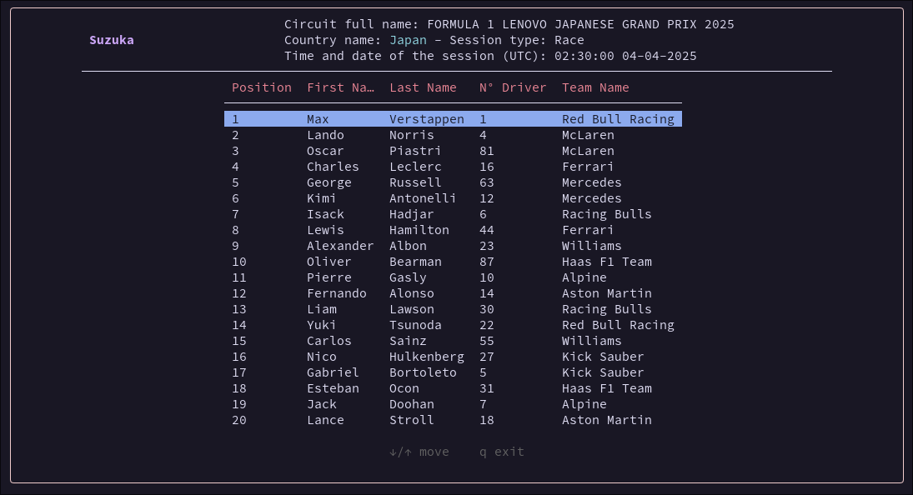

> NOTE:
> This is an unofficial project and is not associated in any way with the Formula 1, F1, FORMULA ONE, FORMULA 1,
> FIA FORMULA ONE WORLD CHAMPIONSHIP, GRAND PRIX and related marks are trade marks of Formula One Licensing B.V.

> FOR DONATION: please consider donating to [openf1](https://openf1.org/) if you want to donate and support this and their project 

# f1 terminal data viewer



## Description

This is a terminal data viewer for formula one session. You can check the result of the previus session if 
there is no session on or you can see real time data for the current session.

## Motivation

I wanted to do this project for challenge my self and see if I can something like this.
I have no interest in make this a commercial platform or anythig that include payment.

## Quick Start

You need to have golang installed, if you don't have it please follow the step in this page: 
[golang installation](https://go.dev/doc/install)

After you have installed golang. Clone this reapo in your terminal:

```bash
git clone https://github.com/mattemello/f1Terminal.git
cd f1Terminal
```

Then you need to compile the program:

```bash
go build
```

And now you have the new program!!!

## Usage

For now there is no flags, but they can arrive in the future!!
For execute:

```bash
./f1Terminal
```

The program itself will try to see if there is a **session on**. If there isn't it will display the previus
session, and it will check every 5 seconds if there is a new session.

In case of **session on** it will be updated every second (the time still need to be confirmed 
in case this progect takes too much resources from [openf1](https://openf1.org/)).

### Thing used

If you have liked this project pleare check out [Charm](https://github.com/charmbracelet) (I used their
library [bubble tea](https://github.com/charmbracelet/bubbletea)), obviously [openf1](https://openf1.org) and also [golang](https://go.dev/)

(Check out also [the official page of f1](https://www.formula1.com/))

## Contributing
Me :D

#### If you have any problem or issue or change please create a issues or a pull-request.
